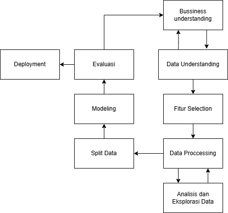

# PREDIKSI DIABETES DENGAN ALGORITMA RANDOM FOREST, LOGISTIC REGRESSION, DAN KNN


Proyek ini menggunakan dataset terkait kesehatan untuk memprediksi kemungkinan seseorang mengidap diabetes. Dengan memanfaatkan algoritma pembelajaran mesin seperti *Random Forest*, *Logistic Regression*, dan *K-Nearest Neighbors (KNN)*, proyek ini bertujuan untuk memberikan prediksi akurat berdasarkan fitur-fitur kesehatan yang tersedia.

## Masalah
Diabetes adalah salah satu masalah kesehatan yang umum dan berkembang di seluruh dunia. Prediksi dini terhadap penyakit ini dapat membantu dalam pencegahan dan pengelolaan yang lebih baik. Dataset yang digunakan berisi berbagai atribut medis yang dapat memengaruhi risiko seseorang terkena diabetes. melakukan diagnosis secara manual untuk setiap pasien membutuhkan waktu dan sumber daya yang besar. Oleh karena itu penggunaan data mining bisa sangat membantu pengambilan Keputusan yang lebih baik

## Tujuan
- **Memahami risiko diabetes**
- **Membangun model prediksi**
- **Evaluasi dan pengujian model**
- **Manfaat bagi kesehatan masyarakat**

## Alur



## EDA
-	Memeriksa Struktur dan Tipe Data sesuai
-	Menangani missing data
-	Memvisualisasikan distribusi data
-	Mengidentifikasi korelasi antar fitur
-	Menangani outlier
-	Transformasi data (normalisasi, encoding)
-	Mempersiapkan data untuk model (split data)


## Fitur Utama

- **Preprocessing Data**: Menghapus data yang tidak relevan, menangani nilai null, dan memastikan data konsisten.
- **Exploratory Data Analysis (EDA)**: Visualisasi distribusi data, deteksi outlier, dan korelasi antar fitur.
- **Modeling**: Implementasi dan evaluasi beberapa model pembelajaran mesin.
- **Model Persistence**: Penyimpanan dan pemuatan model menggunakan file `.pkl`.

## Dataset

Dataset yang digunakan memiliki kolom berikut:

Attribut
- **Gender**: Jenis kelamin (1 = Male, 0 = Female)
- **Age**: Usia
- **Urea**: Kadar urea dalam darah
- **Cr**: Creatinine ratio
- **HbA1c**: Rata-rata kadar gula darah 3 bulan terakhir
- **Chol**: Kolesterol total
- **TG**: Trigliserida
- **HDL**: High-density lipoprotein
- **LDL**: Low-density lipoprotein
- **VLDL**: Very low-density lipoprotein
- **BMI**: Body mass index

Label
- **CLASS**: Label target (Diabetic/Non-Diabetic)


## Proses Modeling
-	Pemilihan model
-	Pembagian data
-	Pelatihan Model
-	Menyimpan Model
-	Menguji Model
-	Evaluasi

## Instalasi

1. Clone repositori ini:

   ```bash
   git clone https://github.com/username/project-diabetes-prediction.git
   cd project-diabetes-prediction
   ```

2. Instal dependensi yang diperlukan:

   ```bash
   pip install -r requirements.txt
   ```

3. Pastikan dataset tersedia dalam direktori utama dengan nama `Dataset of Diabetes .csv`.

## Penggunaan

1. Jalankan notebook atau script Python untuk preprocessing, EDA, dan modeling.

   ```bash
   python main.py
   ```

2. Model yang dilatih akan disimpan sebagai file `.pkl` dan dapat digunakan untuk prediksi di masa mendatang.

## Evaluasi Model

### Random Forest

**Akurasi Training**: 1.00
**Akurasi Testing**: 0.98


### Logistic Regression

**Akurasi Training**: 0.81

**Akurasi Testing**: 0.80


### K-Nearest Neighbors (KNN)

**Akurasi Training**: 0.85

**Akurasi Testing**: 0.79

**Laporan Klasifikasi (Testing):**


## Kesimpulan

- *Random Forest* memberikan performa terbaik dengan akurasi 98% pada data pengujian.
- *Logistic Regression* dan *KNN* menunjukkan akurasi yang lebih rendah, terutama karena ketidakseimbangan kelas dalam dataset.
- Dataset perlu dioptimalkan lebih lanjut untuk meningkatkan performa model selain *Random Forest*.

